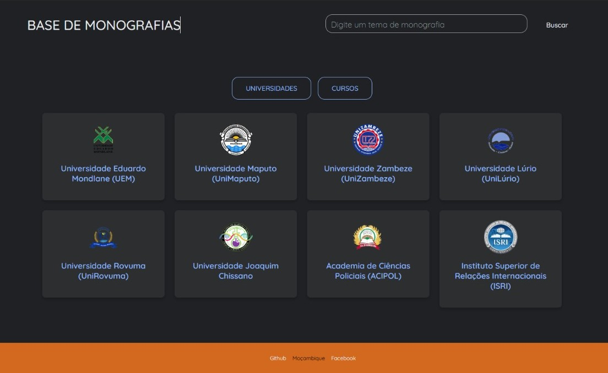

# 📚 Base de Monografias



O projeto **Base de Monografias** é um repositório centralizado de conhecimento acadêmico, criado para facilitar o acesso a trabalhos de conclusão de curso e dissertações de diversas universidades de Moçambique. A plataforma oferece uma interface simples e intuitiva para pesquisar e encontrar monografias por tema ou navegar por instituição.

## 🎯 Sobre o Projeto

A busca por referências acadêmicas e trabalhos anteriores pode ser uma tarefa desafiadora. Este projeto nasceu com o objetivo de simplificar esse processo, agregando em um único lugar links para monografias de importantes universidades moçambicanas. Ele serve como um ponto de partida para estudantes, pesquisadores e curiosos que buscam conhecimento relevante e localizado.

### ✨ Funcionalidades

- **Busca Inteligente:** Pesquise por temas, palavras-chave ou títulos de monografias.
- **Navegação por Universidade:** Explore os trabalhos acadêmicos agrupados por universidade.
- **Acesso Direto:** Links diretos para o repositório original da monografia, garantindo acesso ao documento completo.
- **Interface Limpa e Responsiva:** Design simples e adaptável a diferentes tamanhos de tela.

## 🛠️ Tecnologias Utilizadas

Este projeto foi construído utilizando tecnologias web padrões, focando na simplicidade e performance.

- **HTML5:** Para a estruturação do conteúdo e da semântica do site.
- **CSS3:** Para a estilização, layout e responsividade.
- **JavaScript (Vanilla):** Para a interatividade, manipulação do DOM e implementação da funcionalidade de busca.
- **JSON:** Como formato de banco de dados para armazenar as informações das monografias.

## 📂 Estrutura do Projeto

O projeto está organizado da seguinte forma:

```
Base de conhecimento/
├── 📄 Index.html         # Página principal com a busca e lista de universidades
├── 📄 data.json           # Arquivo com os dados das monografias
├── 📄 Script.js          # Lógica de busca e renderização dos resultados
├── 📄 Styles.css         # Folha de estilos principal
├── 📁 images/              # Pasta com os logos das universidades
└── 📄 README.md          # Este arquivo
```

## 🚀 Como Executar Localmente

Para executar o projeto em sua máquina local, siga os passos abaixo. Não é necessário nenhum servidor ou processo de build complexo.

1.  **Clone o repositório:**
    ```sh
    git clone https://github.com/seu-usuario/seu-repositorio.git
    ```

2.  **Navegue até a pasta do projeto:**
    ```sh
    cd Base de conhecimento
    ```

3.  **Abra o arquivo `Index.html` no seu navegador de preferência.**

Pronto! A aplicação estará funcionando localmente.

## 🤝 Como Contribuir

Contribuições são o que tornam a comunidade de código aberto um lugar incrível para aprender, inspirar e criar. Qualquer contribuição que você fizer será **muito bem-vinda**.

1.  Faça um **Fork** do projeto.
2.  Crie uma **Branch** para sua modificação (`git checkout -b feature/nova-funcionalidade`).
3.  Faça o **Commit** de suas mudanças (`git commit -m 'Adiciona nova funcionalidade'`).
4.  Faça o **Push** da Branch (`git push origin feature/nova-funcionalidade`).
5.  Abra um **Pull Request**.

## ✍️ Autor

**Marco Nhaca**

- GitHub: @Marco-Nhaca
- Facebook: marco.nhaca

---
